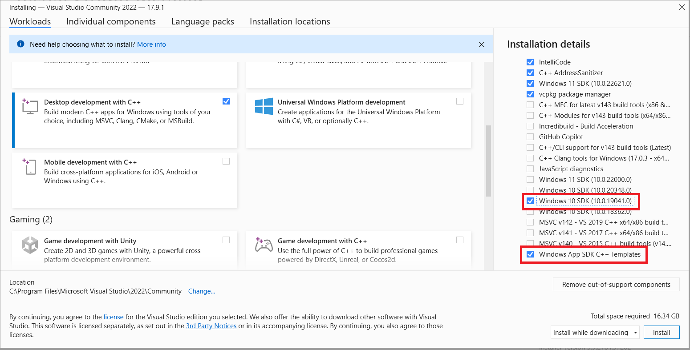

# PlanetKit quick start for Windows

This repository provides a quick start project implemented with PlanetKit for Windows.

> This quick start project is based on PlanetKit 5.4.x.

## About PlanetKit SDK

PlanetKit is a client SDK for LINE Planet, which is a cloud-based real-time communications platform as a service (CPaaS) that helps you build a voice and video call environment. With LINE Planet, you can integrate call features into your service at minimum cost.

### PlanetKit system requirements

The system requirements of PlanetKit for Windows are as follows.

#### Operating system requirements

- Windows 10 or higher

### How to download the SDK

You can download the PlanetKit SDK through [PlanetKit Windows](https://github.com/line/planet-kit-windows/releases).

### References

- [PlanetKit system requirements](https://docs.lineplanet.me/overview/specification/planetkit-system-requirements#windows)
- [API Reference](https://docs.lineplanet.me/api-reference/client/windows/5.4/index.html)

### Release information

- [API changelog](https://docs.lineplanet.me/windows/reference/api-changelog)
- [Release notes](https://docs.lineplanet.me/windows/reference/release-notes)

## Using the quick start project

This quick start project provides basic functionality of a **group audio call**.

> We provide two projects for this quick start project, each implemented with **MFC** and **WinUI 3**. Please choose which one to use and follow the guide accordingly.

### Prerequisites

#### Visual Studio 2022

- To build this quick start project, you need Visual Studio 2022. If Visual Studio 2022 is not installed in your environment yet, [install Visual Studio 2022](https://visualstudio.microsoft.com/downloads/).
- On the **Workloads** tab, select **Desktop development with C++** for C++ app development using the Windows App SDK.

  

- To use the MFC project
  - On the **Individual components** tab, select **C++ MFC for latest v143 build tools (x86 & x64)** to build a C++ MFC project.

    

- To use the WinUI 3 project
  - In the **Installation details** pane of the installation dialog box, select **Windows 10 SDK (10.0.19041.0)** and **Windows App SDK C++ Templates**.

    

#### Python

- Python 3.8 or higher
  - Open Command Prompt and run `python3`.
    - Download Python 3 on Microsoft Store.
  - Or, you can manually download and install a [supported version of Python 3.x](https://www.python.org/downloads/).

### 1. Download source code and install the SDK

- Clone this repository and change to the directory.
- To install the SDK, update the submodule.

  ```bash
  c:\git\planet-kit-quickstart-windows>git submodule update --init --recursive
  ```

### 2. Open the project

In Visual Studio, open the project of source code you downloaded. (Choose **Open a project or solution**.)


#### MFC project

- Choose the project `GroupAudioCall\GroupAudioCallMFC\GroupAudioCallMFC.sln`.

#### WinUI 3 project

- Choose the project `GroupAudioCall\GroupAudioCallWinUI3Cpp\GroupAudioCallWinUI3Cpp.sln`.

### 3. Generate an access token

> In this quick start project, we provide a script that generates an access token for your convenience. However, during the actual implementation of your app, the access token must be created in the AppServer. For more information, refer to [Access token](https://docs.lineplanet.me/getting-started/essentials/access-token).

Generate an [access token](https://docs.lineplanet.me/overview/glossary#access-token) using `generate_access_token.py`.

- The script requires a valid user ID as an argument. For the naming restrictions of a user ID, see [User ID](https://docs.lineplanet.me/overview/glossary#user-id).
- Python package requirement for `generate_access_token.py` can be found in `requirements.txt`.
  - You can use the command `python3 -m pip install -r requirements.txt` to install required packages.

> We recommend using a virtual environment for this step. For more information, see [how to use venv](https://packaging.python.org/en/latest/guides/installing-using-pip-and-virtual-environments/).

```bash
C:\git\planet-kit-quickstart-windows\GroupAudioCall>python3 generate_access_token.py <YOUR_USER_ID>
access token:  <GENERATED_ACCESS_TOKEN>
```

### 4. Apply the user ID and the access token

Copy and paste the user ID and access token into your code.

```cpp
// src/Constants.h
    constexpr wchar_t USER_ID[] = L"<YOUR_USER_ID>"; // Copy and paste the user ID that you used when generating access token.
    constexpr wchar_t ACCESS_TOKEN[] = L"<GENERATED_ACCESS_TOKEN>"; // Copy and paste the access token generated by the tool.
```

### 5. Build and run the project

- Build the quick start project. (**Build > Build Solution**)
- Run the quick start project. (**Debug > Start Debugging** or **Start Without Debugging**)

### 6. Join a group audio call

Enter a room ID and click the **Join** button.

> To join the call successfully, you need to enter a valid room ID. For the naming restrictions of a room ID, see [Room ID](https://docs.lineplanet.me/overview/glossary#room-id).

One you're connected to the call, you can communicate with other participants.

#### MFC project


#### WinUI 3 project


## Troubleshooting

### Call connection issues

If the group call cannot be connected, please check [PlanetKit::EStartFailReason](https://docs.lineplanet.me/api-reference/client/windows/5.4/namespace_planet_kit.html#a73be4867198309af56252749a8a51ac2) and [PlanetKit::EDisconnectReason](https://docs.lineplanet.me/api-reference/client/windows/5.4/namespace_planet_kit.html#adcd793bf6e3b3f134925da037a9d60a4).

```cpp
// check PlanetKit::EStartFailReason
// src/GroupAudioCallController.cpp
....
auto sStartResult = pPlanetKitManager->JoinConference(pConferenceParam, m_pConference);

if (sStartResult.bSuccess == false) {
    m_pEventListener->FailedToJoin((int)sStartResult.reason);
}
```

```cpp
// check PlanetKit::EDisconnectReason
// src/ConferenceEventListener.cpp
....
void ConferenceEventListener::OnDisconnected(PlanetKit::PlanetKitConferencePtr pPlanetKitConference, PlanetKit::ConferenceDisconnectedParamPtr pParam) {
    auto eReason = pParam->GetReason();
```

### Compile error with code `E1696`


- This compilation error occurs because the PlanetKit SDK file cannot be found, which is because the submodule has not been updated.
- To resolve this, open Command Prompt and update the submodule using git.

  ```bash
  c:\git\planet-kit-quickstart-windows>git submodule update --init --recursive
  ```

## Issues and inquiries

Please file any issues or inquiries you have to our representative or [dl\_planet\_help@linecorp.com](mailto:dl_planet_help@linecorp.com). Your opinions are always welcome.

## FAQ

You can find answers to our frequently asked questions in the [FAQ](https://docs.lineplanet.me/help/faq) section.
